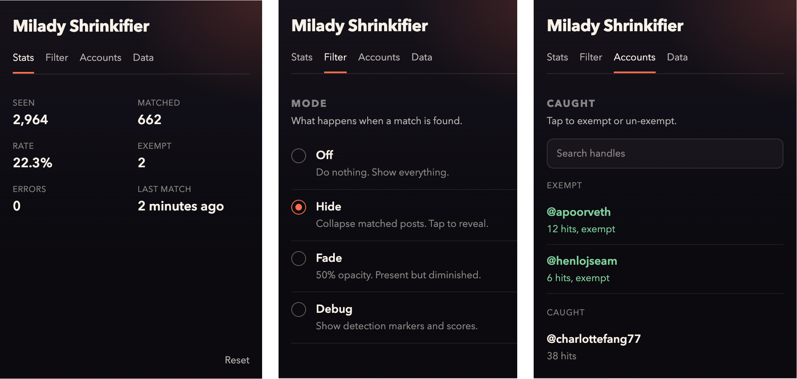

# Milady Shrinkifier

*protecting your timeline from the egregore since 2026*

## Why

Some people find that a significant percentage of their timeline consists of accounts using aesthetically identical chibi avatars posting aesthetically identical content. This extension addresses that.

## How It Works

A bundled ONNX classifier scans avatars as you scroll. When it spots a match, you pick what happens:

- **Hide** — collapsed behind a click-to-reveal row.
- **Fade** — visible but at half opacity.
- **Debug** — borders and confidence scores on every post.
- **Off** — does nothing.

The popup tracks session stats (posts scanned, match rate, last sighting), keeps a list of detected accounts you can exempt individually, and collects avatar data you can export for offline labeling.

Everything runs locally. No server calls, no telemetry, nothing leaves your browser unless you explicitly export it.

## Install

There is no Chrome Web Store release. Install from [GitHub Releases](https://github.com/banteg/milady-shrinkifier/releases) instead:

1. Download the latest `milady-shrinkifier-vX.Y.Z-unpacked.zip` from the [Releases page](https://github.com/banteg/milady-shrinkifier/releases).
2. Unzip it somewhere permanent on disk.
3. Open [`chrome://extensions`](chrome://extensions).
4. Enable `Developer mode`.
5. Click `Load unpacked`.
6. Select the unzipped folder.

## Accuracy

All scores below come from the current manually reviewed exported corpus.

- **Precision** — when the extension filters a post, how often it's right.
- **Recall** — of the Milady-style avatars in the evaluation set, how many it catches.
- **Evaluation corpus** — `7,695` exported avatars (`437` milady, `7,258` not_milady).
- This is broader than the blind split and still fully human-labeled, but it is not a blind benchmark.

| Version | Run | Training mix | Precision | Recall |
| --- | --- | --- | --- | --- |
| `v0.2.2` | `20260327T142224Z` | Milady Maker + `2,596` manually tagged avatars | `0.9961` | `0.5904` |
| `v0.3.0` | `20260327T212453Z` | + Remilio, Pixelady + `2,967` manually tagged avatars | `1.0000` | `0.7208` |
| `v0.4.0` | `20260328T144735Z` | + `5,715` manually tagged avatars | `0.9971` | `0.7918` |
| `v0.5.0` | `20260328T223931Z` | + `6,773` manually tagged avatars | `0.9952` | `0.9451` |
| `v0.6.0` | `20260329T124912Z` | + `7,370` human-reviewed avatars | `0.9952` | `0.9474` |
| `Current` | `20260329T181946Z` | + `7,695` human-reviewed avatars | `0.9951` | `0.9291` |

All rows were re-evaluated on the same manually reviewed exported corpus on March 29, 2026, so they are directly comparable.

## Development

See [DEVELOPMENT.md](DEVELOPMENT.md) for build commands and debugging.

For a user-facing walkthrough of how the offline training loop works end to end, see [docs/training-pipeline.md](docs/training-pipeline.md).
